# O-RIS MATLAB Project

A MATLAB-based proof-of-concept for an **Omnidirectional Reconfigurable Intelligent Surface (O-RIS)** workflow, covering urban coverage modeling, aperture synthesis, 3D radiation visualization, control-matrix design, PIN diode circuit behavior, and system-level integration.

## Highlights

- Urban RF ray-tracing and coverage mapping
- Beam steering and aperture synthesis analysis
- 3D radiation-pattern generation with animation frames
- PIN diode switching and control-matrix simulation
- Combined system integration and performance reporting

## Screenshot / Results Gallery

### Core results

| Urban coverage | Beam steering patterns | 3D radiation pattern |
|---|---|---|
| 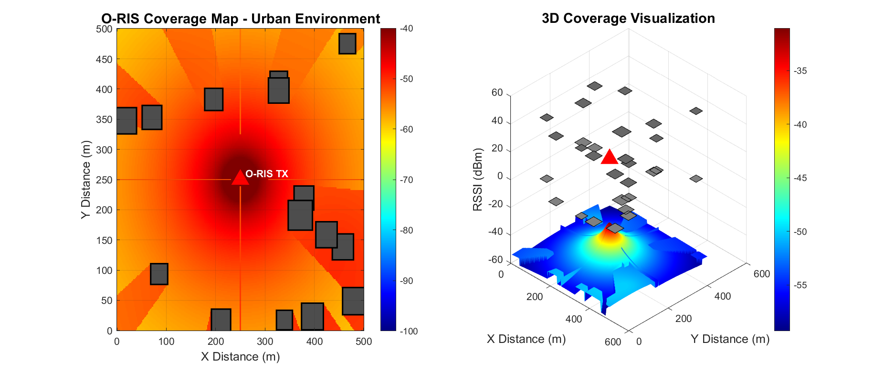 | 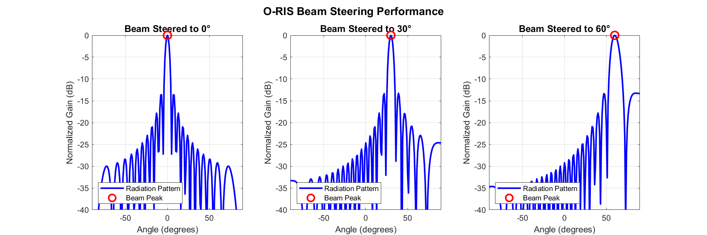 | 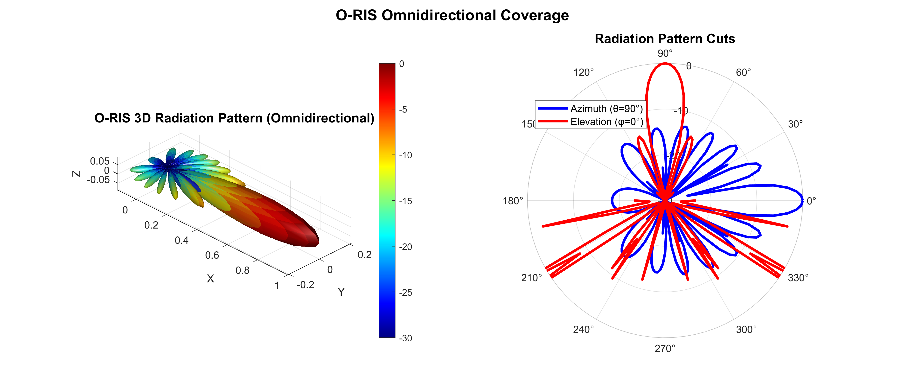 |

| Pattern comparison | Presentation summary | Integration performance |
|---|---|---|
| 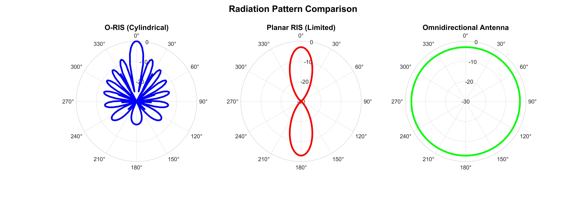 | 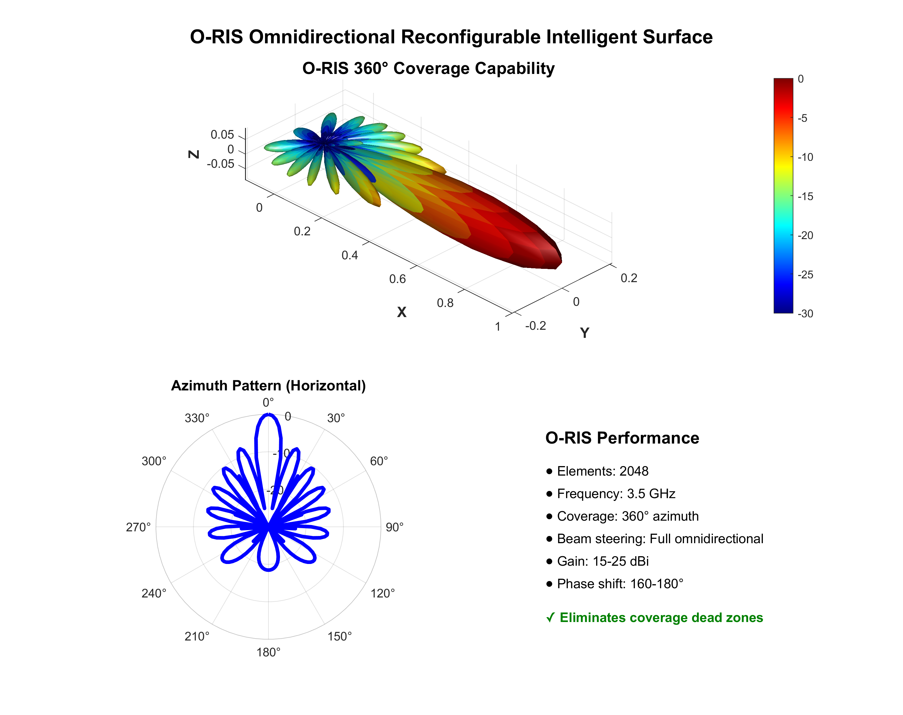 | 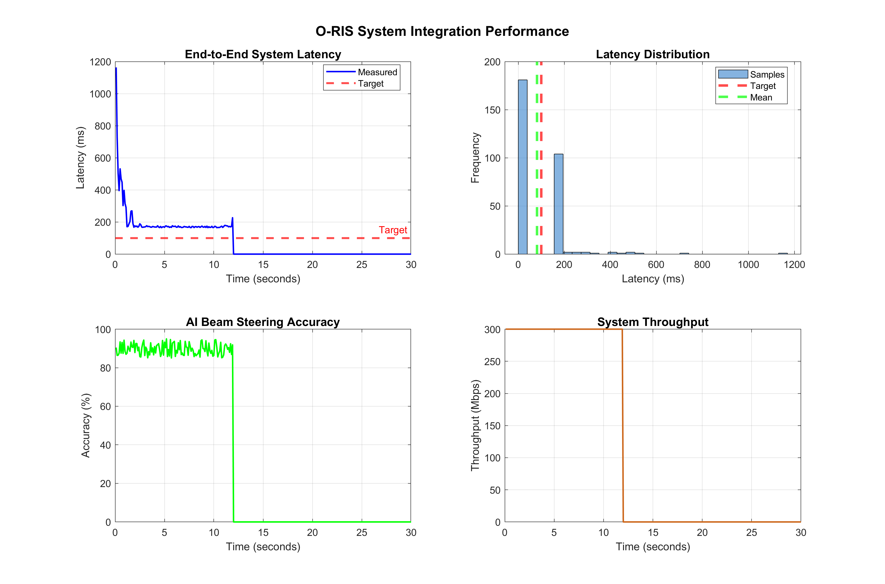 |

### Beam steering animation frames

| Frame 1 | Frame 2 | Frame 3 | Frame 4 |
|---|---|---|---|
| 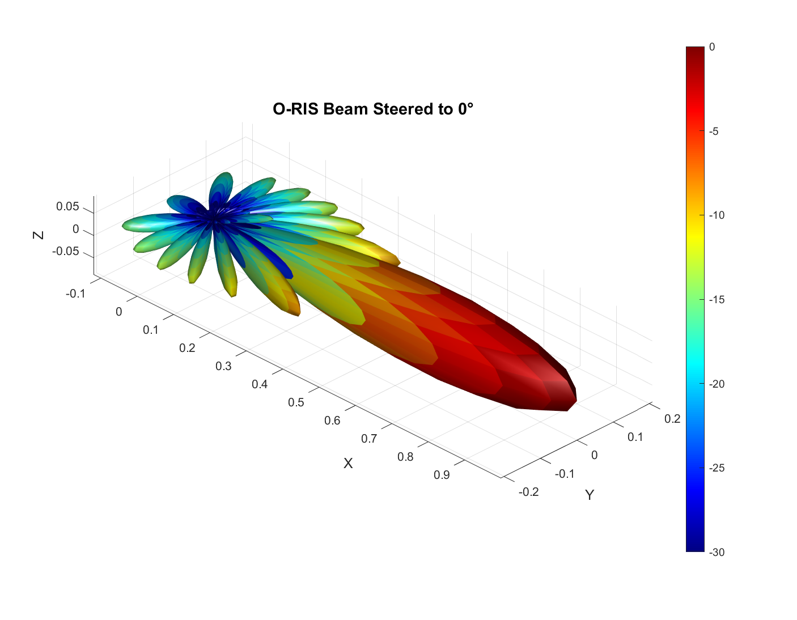 | 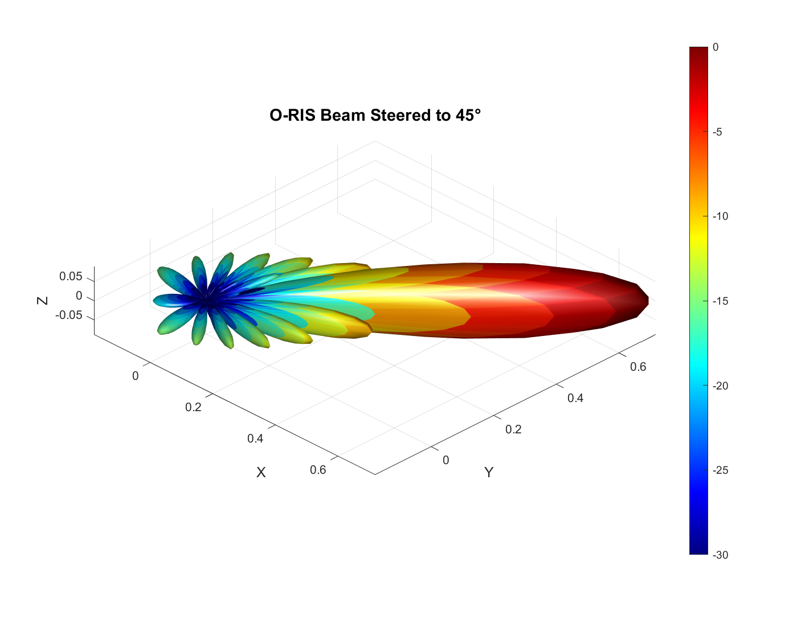 | 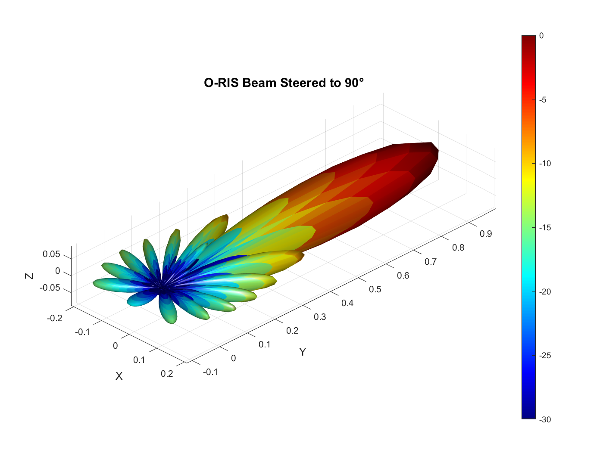 | 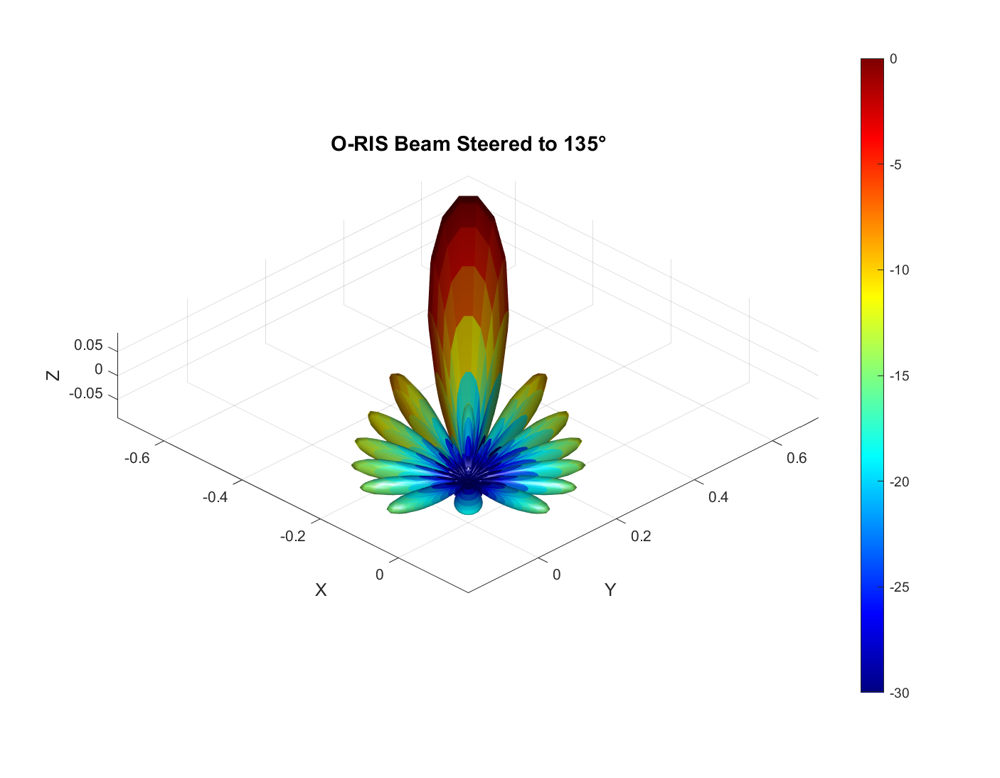 |

| Frame 5 | Frame 6 | Frame 7 | Frame 8 |
|---|---|---|---|
| 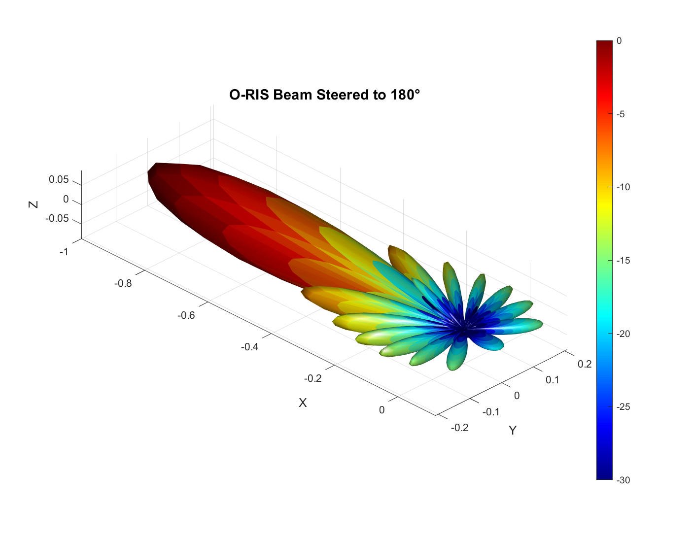 | 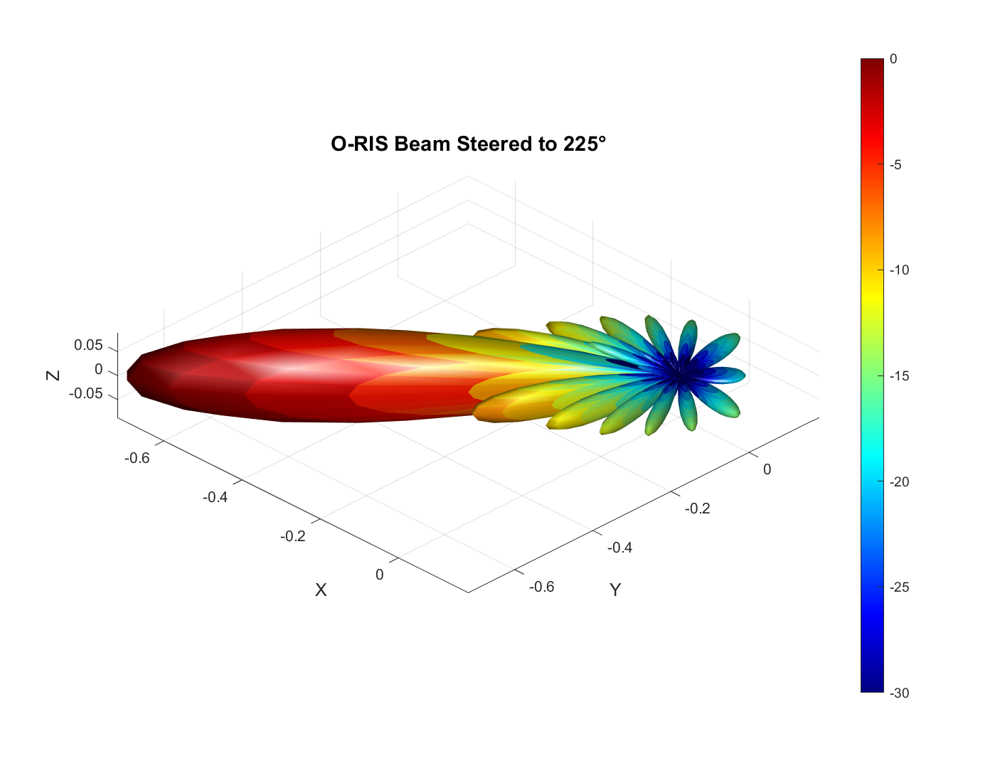 | 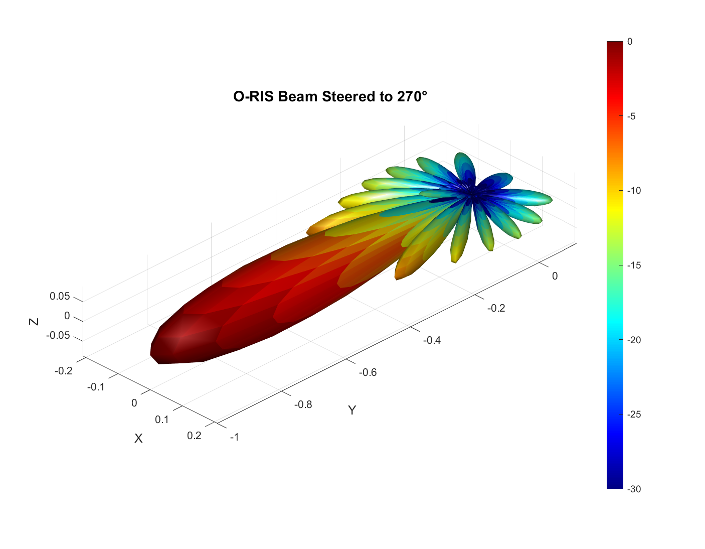 | 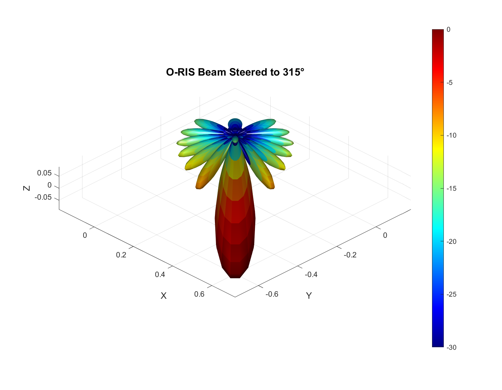 |

## Main MATLAB scripts

| Script | Purpose |
|---|---|
| `oris_urban_raytracing.m` | Simulates urban propagation and generates coverage results |
| `oris_aperture_synthesis.m` | Validates aperture synthesis and beam steering behavior |
| `oris_sparameter_processing.m` | Processes and plots S-parameter results |
| `oris_3d_radiation_patterns.m` | Builds 3D radiation patterns, comparisons, and steering frames |
| `oris_master_integration.m` | Runs the system integration workflow and logs performance |
| `pin_diode_circuit_simulator.m` | Models PIN diode switching and phase shift behavior |
| `control_matrix_simulator.m` | Generates beam-steering control matrices and GPIO sequences |
| `combined_system_simulator.m` | Combines circuit, control, and radiation analysis |

## How to run

Open the folder in MATLAB, then run the scripts you want:

```matlab
run('oris_urban_raytracing.m')
run('oris_aperture_synthesis.m')
run('oris_sparameter_processing.m')
run('oris_3d_radiation_patterns.m')
run('oris_master_integration.m')
```

For the hardware/control simulators:

```matlab
run('pin_diode_circuit_simulator.m')
run('control_matrix_simulator.m')
run('combined_system_simulator.m')
```

## Generated outputs

The repository already includes the main screenshot outputs as PNG files, plus supporting `.mat` and log files.

### Included figures

- `oris_urban_coverage_map.png`
- `oris_beam_steering_patterns.png`
- `oris_3d_radiation_pattern.png`
- `oris_pattern_comparison.png`
- `oris_presentation_summary.png`
- `oris_integration_performance.png`
- `beam_steering_frame_001.png` to `beam_steering_frame_008.png`

### Included data files

- `oris_coverage_results.mat`
- `oris_aperture_synthesis_results.mat`
- `oris_radiation_patterns.mat`
- `oris_integration_results.mat`

## Requirements

- MATLAB R2019b or later recommended
- Base MATLAB is enough for the included scripts
- Optional toolboxes may improve analysis and visualization

## Notes

- All image paths in this README are relative to the repository root, so they work on GitHub.
- The beam steering frame images can be combined into a short animation if needed.
- If you regenerate any figures, keep the same filenames so the README gallery stays valid.

## Project summary

This project demonstrates an O-RIS workflow from simulation to visualization:

1. Urban RF propagation modeling
2. Aperture and beam steering validation
3. Radiation-pattern generation
4. Control-matrix and PIN diode simulation
5. System integration and performance reporting

---

If you want, I can also turn this into a more polished **project homepage README** with badges, a table of contents, and a smaller mobile-friendly image layout.